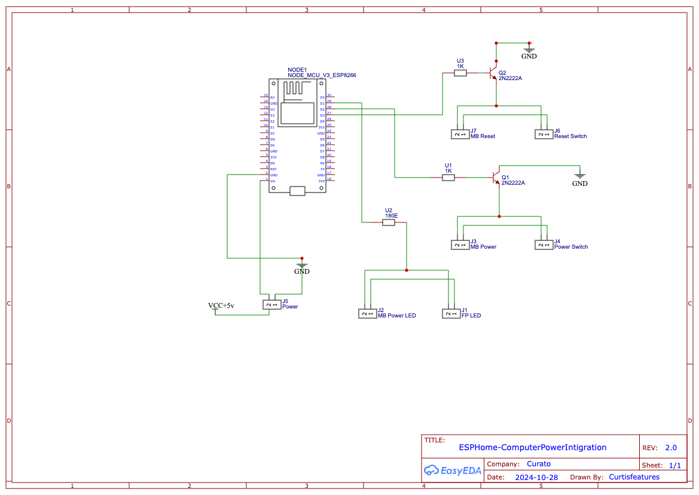
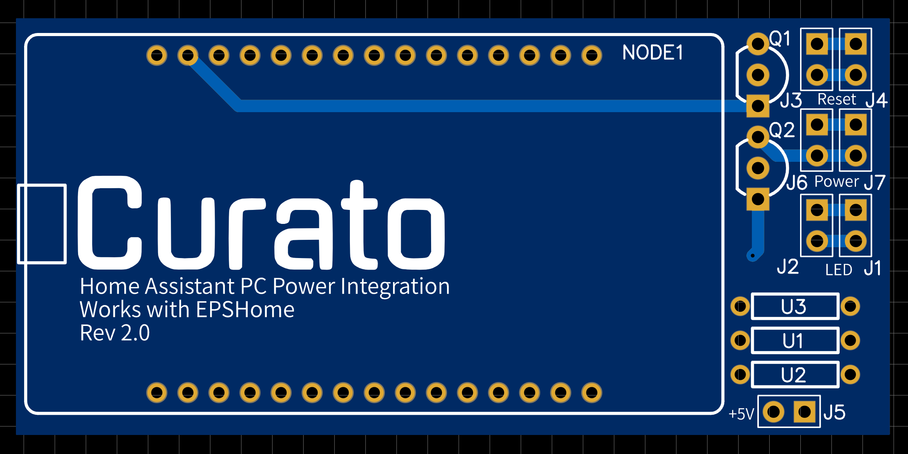

# ESPHome-ComputerPowerIntigration

This **ESPHome** project enables remote control of a PC’s **power** and **reset** functions using an **ESP8266 (NodeMCU)** board. With short and long press options for power management, this setup integrates seamlessly with **Home Assistant** for enhanced control.

## Features

- **Power Control**: Toggle the PC power state via a GPIO-connected relay.
- **Reset Control**: Remotely activate the reset switch.
- **Short and Long Presses**: Send either a short or long press signal to control power states with precision from software.
- **Power State Monitoring**: Monitor the PC’s power state.

## Requirements

- **Hardware**: NodeMCU ESP8266 (Optional PCB)
- **Software**: Home Assistant with ESPHome integration.
- **Power**: Connect to a always on 5V and Ground header (such as USB) - Changes to your Bios may need to be made.

## Installation

1. **Download Files**:
   - Download EPSHome.YAML
     
2. **Configure the ESPHome YAML file**:
   - Update Wi-Fi credentials in the `wifi` section.
   - Update the Device name 
   - Specify your encryption key under the `api` section.

3. **Flash the ESP8266**:
   - Upload the YAML configuration to your ESP8266 using ESPHome.

4. **Integrate with Home Assistant**:
   - Once flashed, add the ESP device in Home Assistant via the ESPHome integration to expose control switches for power, reset, and short or long press actions.
     
## Usage

### Home Assistant Dashboard

- **Power Control**: Use the `switch.power_control` entity to toggle PC power.
- **Reset Switch**: Use `switch.reset_switch` to remotely trigger a reset.
- **Short and Long Presses**: Use `switch.short_press` and `switch.long_press` entities to send simulated short or long press actions to your circuit.

### YAML Configuration Overview

This configuration includes:
- **GPIO Switches** for controlling power and reset actions.
- **Template Switches** that simulate short and long press actions for flexible power management.
- **Binary Sensors** to monitor the PC’s power state.

  # Bill of Materials (BOM)

| **Item**                                | **Description**                                                                                                               | **Quantity** |
|-----------------------------------------|-------------------------------------------------------------------------------------------------------------------------------|--------------|
| **2-Pin 2.54mm Male Header Pins**       | Standard 2-pin male headers, 2.54mm pitch, suitable for breadboards or PCB connections. Each pin is 2.54mm apart.             | 7            |
| **2N2222A NPN Transistor**              | General-purpose NPN transistor, suitable for switching and amplification in various circuits. **Max Voltage:** 40V, **Max Current:** 800mA. | 2            |
| **1K Resistor**                         | Fixed resistor, **Value:** 1kΩ, **Tolerance:** ±5%, **Power Rating:** 0.25W or 0.125W.                                       | 2            |
| **180Ω Resistor**                       | Fixed resistor, **Value:** 180Ω, **Tolerance:** ±5%, **Power Rating:** 0.25W or 0.125W.                                       | 1            |
| **NodeMCU V3 ESP8266**                  | Development board with ESP8266 Wi-Fi module, suitable for IoT applications and compatible with the Arduino IDE. **Voltage:** 3.3V for I/O, **Input Voltage:** 5V via USB. | 1            |
| **2-Pin Female-to-Female Dupont Cable** | Jumper wires with female connectors on each end, suitable for making connections on the NodeMCU board and peripherals. **Length:** Commonly 10-20cm. | 4            |

